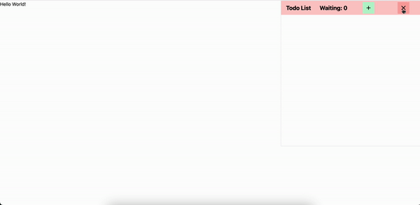

# Sticky Todos

we can liken Sticky Todos to a notepad. However, Sticky Todos is specifically designed for the use of Laravel developers as a Vue.js component package. Like a notepad, it allows users to quickly take notes and create to-do lists. However, Sticky Todos is specially designed to meet the needs of developers who want to add to-do list features in Laravel applications.



## Installation

### Step 1: Install the package

```bash
composer require ahmetbarut/laravel-sticky-todos
```

### Step 2: Publish the package assets

```bash
php artisan vendor:publish --provider="AhmetBarut\StickyTodos\StickyTodosServiceProvider" --tag="sticky-todos-public"
```

### Step 3: Add the component to your view

Sticky-todos usage migrations for store data.

```bash
php artisan migrate
```

### Step 4: Disable Sticky Todos

If you want to disable Sticky Todos, you can do so by setting the STICKY_TODOS_ENABLED environment variable to false in your .env file.

```env
STICKY_TODOS_ENABLED=false
```
